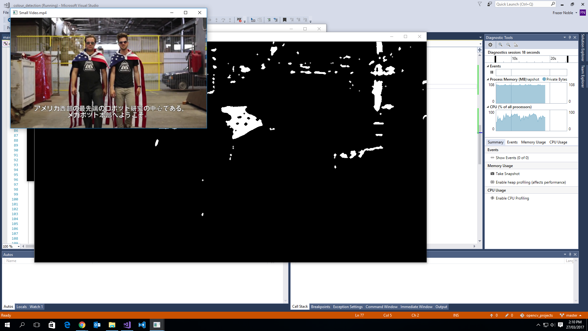

# colour_detection

# Description

Demonstrates how the Open Computer Vision (OpenCV) library can be used to detect a colour. The command line can be used to modify the program's behavior. Works for either an image (.jpg, .png) or a video (.mp4, .avi) file.

# Table of Contents

1. Requirements.
1. Installation.
1. Usage.
1. Contribution.
1. Credits.

# Requirements

I have used the following tools and libraries to create this project:

1. [gflags](https://github.com/gflags/gflags).
1. [CMake](https://cmake.org/).
1. [OpenCV 3.20](http://opencv.org/).
1. [Microsoft Visual Studio 2017](https://www.visualstudio.com/).
1. A video (.mp4, .avi) or image (.jpg, .png) file.

To help ensure everything works, I'd also suggest you create the following enrionmental variables:
1. OPENCV_DIR C:/opencv/opencv/build. Note, this is the directory wherever you installed OpenCV.
1. DEV_LIBRARIES C:/dev_libraries. Note, this is the directory wherever you have/will put the built gflags repo.

# Installation

1. Clone the opencv_projects repo'.
1. Clone the gflags repo'.
1. If you've not done so already, build gflags using CMake as an Administrator. Also, ensure 'Shared Libraries' are enabled. Once completed, by default, you should find that there is now a C:/Program Files/gflags directory, which contains an Include and Lib sub-directory. Move this directory to C:/dev_libraries/.
1. Open the colour_dectection.sln file.
1. Change the solution platforms from x86 to x64, if necessary.
1. Build the project.

At this point everything should compile and run. You should have three windows appear, as depicted below.

# Usage

When you run the executable it'll it'll look for a particular colour.

Here's a screen shot of the expected outputs:

If you call colour_detection.exe from the command line, you can use the following flags:  
-i to set the input directory.  
-f to set the file name.  
-o to set the output directory.  
-d to set the debug flag.  

# Contribution

If you feel like you can make a contribution; please, feel free to make a request.

# Credits

Dr. Frazer K. Noble
